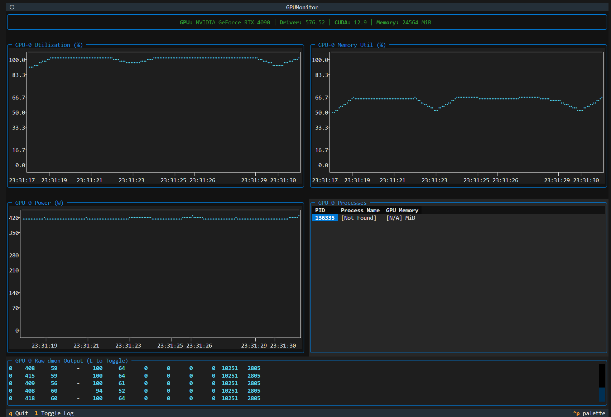

# GPUMon

A simple terminal-based GPU monitoring tool for NVIDIA GPUs built with [Textual](https://textual.textualize.io/). Provides real-time visualization of GPU utilization, memory usage, power consumption, and running processes.



## Features

- Real-time GPU utilization, memory usage, and power consumption graphs
- Process monitoring with PID, name, and GPU memory usage
- Interactive terminal UI with keyboard controls
- Configurable polling intervals and history size
- Support for multi-GPU systems (monitor individual GPUs)
- Raw `nvidia-smi dmon` output viewing (toggle with `L`)

## Requirements

- Python 3.12 or higher
- NVIDIA GPU with driver installed
- `nvidia-smi` command-line utility

## Installation

### Using uv (recommended)

```bash
uv pip install .
```

### Using pip

```bash
pip install .
```

### Development Installation

```bash
uv pip install -e ".[dev]"
```

## Usage

### Basic Usage

Monitor the default GPU (GPU 0):

```bash
gpumon
```

### Monitor a Specific GPU

```bash
gpumon 1
```

### Command-Line Arguments

```
usage: gpumon [-h] [-s HISTORY_SIZE] [-d DMON_POLL_INTERVAL]
              [-p PROC_POLL_INTERVAL] [-t LOCAL_TIMEZONE] [gpu_id]

positional arguments:
  gpu_id                ID of the GPU to monitor (default: 0)

optional arguments:
  -h, --help            show this help message and exit
  -s HISTORY_SIZE, --history_size HISTORY_SIZE
                        Number of historical data points to keep in plots
                        (default: 1000)
  -d DMON_POLL_INTERVAL, --dmon-poll-interval DMON_POLL_INTERVAL
                        Interval in seconds between polling GPU stats
                        (default: 1)
  -p PROC_POLL_INTERVAL, --proc-poll-interval PROC_POLL_INTERVAL
                        Interval in seconds between polling process information
                        (default: 3)
  -t LOCAL_TIMEZONE, --local-timezone LOCAL_TIMEZONE
                        Timezone for displaying timestamps
                        (default: US/Arizona)
```

### Examples

Monitor GPU 0 with 2000 data points of history:

```bash
gpumon 0 -s 2000
```

Monitor GPU 1 with faster polling (0.5 second intervals):

```bash
gpumon 1 -d 0.5
```

Monitor with custom timezone:

```bash
gpumon -t "America/New_York"
```

### Running as a Python Module

You can also run GPUMon directly as a Python module:

```bash
python -m gpumon
```

Or run the source file directly:

```bash
python src/gpumon/__init__.py
```

With arguments:

```bash
python -m gpumon 1 -s 2000 -d 0.5
```

## Keyboard Controls

- `q` - Quit the application
- `l` - Toggle raw dmon output log visibility

## Environment Variables

- `LOCAL_TIMEZONE` - Set the default timezone (default: `US/Arizona`)

Example:

```bash
export LOCAL_TIMEZONE="Europe/London"
gpumon
```

## Configuration

GPUMon uses `nvidia-smi` under the hood with the following commands:

- **GPU stats**: `nvidia-smi dmon -d <interval> -i <gpu_id>`
- **Process info**: `nvidia-smi --query-compute-apps=pid,name,used_gpu_memory --format=csv,noheader,nounits`
- **GPU details**: `nvidia-smi -q -i <gpu_id>`

## Display Information

The application displays four panels:

1. **GPU Utilization (%)** - Real-time GPU usage percentage
2. **Memory Utilization (%)** - GPU memory usage percentage
3. **Power (W)** - Current power draw in watts
4. **Processes** - Table of running processes using the GPU

Additionally, a top info bar shows:
- GPU model name
- Driver version
- CUDA version
- Total GPU memory

## Troubleshooting

### nvidia-smi not found

Ensure NVIDIA drivers are properly installed:

```bash
nvidia-smi --version
```

### Permission denied

Some systems may require elevated privileges:

```bash
sudo gpumon
```

### No data appearing

Check that your GPU ID is correct. List available GPUs:

```bash
nvidia-smi -L
```

## Development

### Code Formatting

This project uses Ruff for linting and formatting:

```bash
ruff check .
ruff format .
```

### Project Structure

```
gpumon/
├── src/
│   └── gpumon/
│       └── __init__.py    # Main application code
├── pyproject.toml         # Project configuration
├── uv.lock               # Dependency lock file
└── README.md             # This file
```

## Dependencies

- `textual` - Terminal UI framework
- `textual-plotext` - Plotting widget for Textual
- `pytz` - Timezone support

## License

See LICENSE file for details.

## Author

Alexei Bastidas
