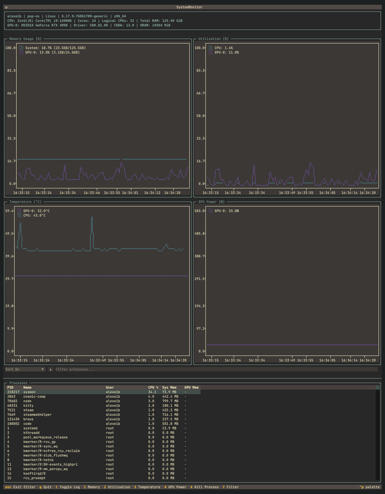

# SysMon

A terminal-based system monitor for CPU and NVIDIA GPU metrics. Built with [Textual](https://textual.textualize.io/).



## Features

- Real-time CPU and GPU utilization graphs
- Memory usage tracking (system RAM and GPU VRAM)
- Temperature monitoring with color-coded thresholds
- GPU power consumption
- Interactive process table with filtering and process management

## Requirements

- Python 3.12+
- NVIDIA GPU with `nvidia-smi` (for GPU metrics)
- [uv](https://docs.astral.sh/uv/) (for easy installation)

## Installation

### Using uv (Recommended)

```bash
uv sync
uv run sysmon
```

### Using pip

```bash
pip install -e .
sysmon
```

## Quick Start with sysmon.sh

The included `sysmon.sh` script handles virtual environment creation and dependency installation automatically.

```bash
chmod +x sysmon.sh
./sysmon.sh
```

### Adding to PATH

To run `sysmon` from anywhere, It is recommended to symlink the script to a directory in your PATH:

```bash
ln -s /path/to/gpumon/sysmon.sh /usr/local/bin/sysmon
```

Or copy it directly:

```bash
sudo cp sysmon.sh /usr/local/bin/sysmon
```

Then run from any terminal:

```bash
sysmon
```

Note: The script must remain in the repository directory or be able to locate it, as it references `pyproject.toml` for dependencies.

## Keybindings

| Key | Action |
|-----|--------|
| `q` | Quit |
| `1` | Toggle memory plot |
| `2` | Toggle utilization plot |
| `3` | Toggle temperature plot |
| `4` | Toggle GPU power plot |
| `f` | Focus process filter |
| `k` | Kill selected process |
| `l` | Toggle log panel |

## Process Table

The process table displays running processes with CPU, memory, and GPU usage. Use arrow keys to navigate and `k` to kill the selected process.

Filters can be applied by pressing `f` and entering filter criteria. While interacting with the table, the process list refresh pauses (indicated by border color change).

## Dependencies

- textual
- textual-plotext
- psutil
- pytz